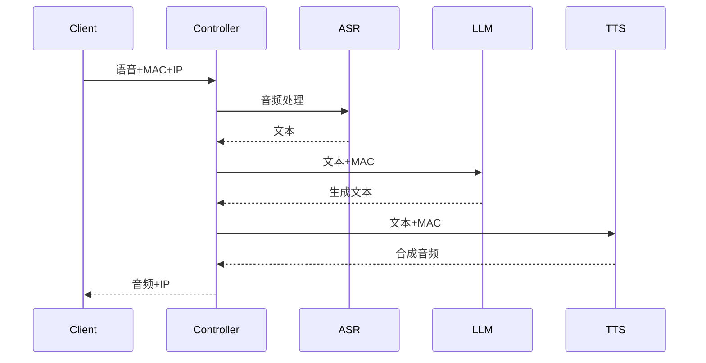
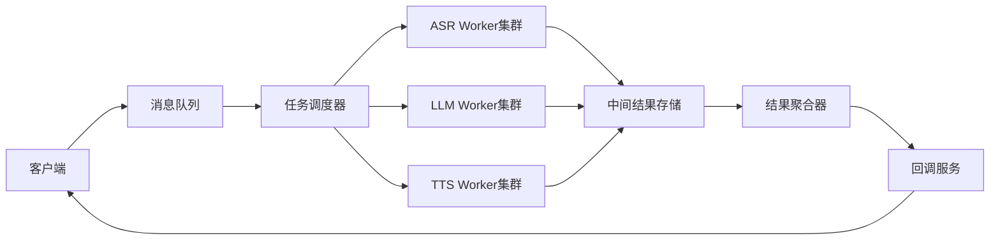
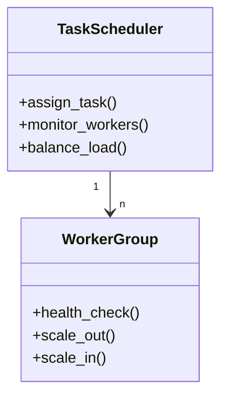

# 架构方案说明

## 方案A：同步管道架构



### 核心特性
1. 线性流水线处理
2. 实时请求-响应模式
3. 强一致性保证
4. 简易调试追踪

### 组件职责
| 组件       | 职责                          | 关键指标           |
|------------|-------------------------------|--------------------|
| 主控制器   | 请求路由/状态跟踪/异常处理     | 请求吞吐量         |
| ASR服务    | 语音识别/文本置信度评估        | 识别准确率         |
| LLM服务    | 语义理解/上下文处理            | 响应相关性         |
| TTS服务    | 语音合成/音色适配              | 合成自然度         |

### 时序保障
1. 顺序调用机制
2. 阶段超时控制（ASR:5s, LLM:30s, TTS:5s）
3. 请求上下文传递
4. 错误快速失败

## 方案B：异步队列架构

## 架构图


## 核心组件说明

### 1. 消息队列 (RabbitMQ/Kafka)
- 采用分区队列保证顺序性
- 消息存活时间：2小时
- 死信队列处理失败任务

### 2. 任务调度器


### 3. 消息格式规范
```json
{
  "task_id": "MAC_TIMESTAMP",
  "stage": "asr|llm|tts",
  "payload": {
    "audio": "base64string",
    "text": "processed_text",
    "context": {}
  },
  "retry_count": 0,
  "timestamp": "ISO8601"
}
```

## 时序保障机制

### 1. 分区策略
- 按MAC地址哈希分区
- 相同设备请求路由到同一分区

### 2. 任务阶段标记
- 每个任务携带处理阶段状态
- 禁止跨阶段跳转

### 3. 超时重试机制
| 处理阶段 | 超时时间 | 最大重试 |
|---------|---------|---------|
| ASR     | 15s     | 3       |
| LLM     | 60s     | 2       | 
| TTS     | 10s     | 3       |

## 部署建议
1. 使用Kubernetes部署Worker集群
2. 为每个服务分配独立命名空间
3. 采用Redis Cluster存储中间结果
4. 使用Prometheus+Grafana监控系统
